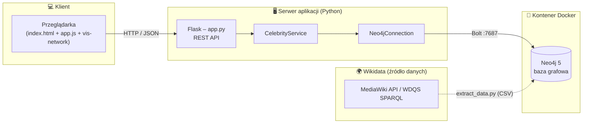
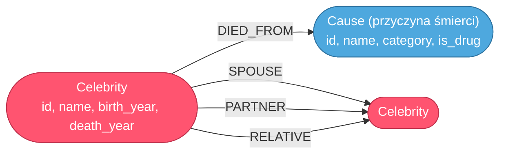

# Dokumentacja projektu — Celebrity–Drug Network

## 1. Cel i zakres
Projekt demonstruje wykorzystanie **bazy grafowej Neo4j** do modelowania i analizy
sieci powiązań między celebrytami a substancjami (przyczynami śmierci związanymi
z używkami) oraz relacji społecznych (małżeństwa, związki, pokrewieństwo).
Wszystkie dane pozyskiwane są **automatycznie z Wikidata**.

Graf pozwala m.in.:
- wskazać „najgroźniejsze” substancje (ranking wg liczby zgonów),
- znaleźć najkrótszą ścieżkę powiązań między dwiema osobami,
- przeglądać ego-sieć wybranej osoby,
- wizualizować całą strukturę.

Stan przykładowego zbioru danych: **75 węzłów `Celebrity`**, **15 węzłów
`Cause`** (przyczyna śmierci; 9 z nich to substancje narkotykowe), **84 relacje**.

---

## 2. Architektura i wdrożenie



**Przepływ:** przeglądarka odpytuje REST API (Flask) → `CelebrityService` tłumaczy
żądania na zapytania Cypher → `Neo4jConnection` wykonuje je w bazie przez protokół
Bolt. Dane są wcześniej pobierane z Wikidata do plików CSV i importowane do Neo4j.

---

## 3. Moduły

| Moduł | Odpowiedzialność |
|-------|------------------|
| `app.py` | trasy REST, serwowanie frontendu |
| `services.py` (`CelebrityService`) | logika domenowa, formatowanie wyników do JSON dla `vis-network` |
| `db.py` (`Neo4jConnection`) | adapter sterownika Neo4j (`query`, `verify`, `close`) |
| `queries.py` | wszystkie zapytania Cypher jako nazwane stałe |
| `extract_data.py` | pozyskanie danych z Wikidata → CSV |
| `load_data.py` | import CSV → Neo4j |

---

## 4. Model grafu



**Węzły**
- `Celebrity` — `id` (QID Wikidata), `name`, `birth_year`, `death_year`.
- `Cause` — przyczyna śmierci (`P509`): `id`, `name`, `category`, `is_drug`.
  Flaga `is_drug` odróżnia substancje narkotykowe (np. *heroin overdose*,
  *barbiturate overdose*) od innych przyczyn (np. *myocardial infarction*,
  *drowning*). Dzięki temu osoby takie jak Michael Jackson czy Elvis Presley
  (w Wikidata: „zawał serca") również łączą się z węzłem przyczyny, a ranking
  „najgroźniejszych substancji" zlicza wyłącznie `is_drug = true`.

**Relacje**
- `(:Celebrity)-[:DIED_FROM]->(:Cause)` — przyczyna śmierci (Wikidata `P509`).
- `(:Celebrity)-[:SPOUSE]->(:Celebrity)` — małżeństwo (`P26`).
- `(:Celebrity)-[:PARTNER]->(:Celebrity)` — związek nieformalny (`P451`).
- `(:Celebrity)-[:RELATIVE]->(:Celebrity)` — pokrewieństwo (`P3373`, `P40`, `P22`, `P25`).

**Ograniczenia (constraints):** unikalność `Celebrity.id` oraz `Cause.id`.

---

## 5. Pozyskiwanie danych z Wikidata (`extract_data.py`)

Skrypt korzysta z dwóch punktów dostępu Wikidata:

1. **MediaWiki API** (`/w/api.php`) — stabilny, służy do *wzbogacenia* każdej
   osoby: przyczyna śmierci (`P509`),
   relacje społeczne (`P26`, `P451`, `P3373`, `P40`, `P22`, `P25`).
2. **WDQS (SPARQL)** — opcjonalnie (`--discover`) do automatycznego *odkrycia*
   listy osób zmarłych wskutek przedawkowania.

**Tryb domyślny (lista startowa)** — zbiór ~30 znanych osób jest rozwiązywany do
QID przez `wbsearchentities` (z weryfikacją, że encja jest człowiekiem, `P31=Q5`),
a wszystkie fakty pobierane są z Wikidata. Daje to bogatszy i stabilniejszy zbiór
danych niż tryb `--discover` (w którym większość zgonów ma jedynie ogólną
przyczynę „drug overdose”).

**Rozszerzenie o sąsiadów:** sieć społeczna samych ofiar przedawkowań jest rzadka,
dlatego graf jest rozszerzany o 1 skok przez `P26`/`P451`. Dzięki temu powstają
ciekawe ścieżki, np. *Elvis Presley → córka Lisa Marie Presley → mąż Michael
Jackson*.

Skrypt zapisuje cztery pliki CSV: `celebrities.csv`, `causes.csv`,
`died_from.csv`, `social.csv`.

---

## 6. Import do Neo4j (`load_data.py`)
Dane są wczytywane w Pythonie i wstawiane parametrycznie (`UNWIND` + `MERGE`)
przez sterownik Bolt — nie wymaga to montowania katalogu importu w kontenerze.

Równoważny zapis z użyciem `LOAD CSV` (do prezentacji w Neo4j Browser):

```cypher
LOAD CSV WITH HEADERS FROM 'file:///celebrities.csv' AS row
MERGE (c:Celebrity {id: row.id})
SET c.name = row.name,
    c.birth_year = toInteger(row.birth_year),
    c.death_year = toInteger(row.death_year);
```

---

## 7. REST API

| Metoda | Ścieżka | Opis |
|--------|---------|------|
| GET | `/api/celebrities` | lista celebrytów |
| GET | `/api/causes` | lista przyczyn śmierci (z flagą `is_drug`) |
| GET | `/api/dangerous` | ranking substancji wg liczby zgonów |
| GET | `/api/network/<id>?depth=1\|2` | ego-sieć wokół celebryty |
| GET | `/api/path?from=<id>&to=<id>` | najkrótsza ścieżka |
| GET | `/api/graph` | cały graf |
| GET | `/api/stats` | statystyki grafu |

Przykład — `GET /api/path?from=Q303&to=Q2831`:

```json
{
  "found": true, "length": 2,
  "steps": [
    {"from": "Elvis Presley", "label": "krewny", "to": "Lisa Marie Presley"},
    {"from": "Lisa Marie Presley", "label": "małżeństwo", "to": "Michael Jackson"}
  ]
}
```

---

## 8. Przykładowe zapytania Cypher

**Najgroźniejsze substancje (ranking, tylko substancje narkotykowe):**
```cypher
MATCH (s:Cause)<-[:DIED_FROM]-(c:Celebrity)
WHERE s.is_drug
RETURN s.name AS substancja, s.category AS kategoria, count(c) AS zgony
ORDER BY zgony DESC;
```
Wynik (fragment):

| substancja | kategoria | zgony |
|------------|-----------|-------|
| drug overdose | przedawkowanie (ogólne) | 14 |
| barbiturate overdose | depresant | 2 |
| heroin overdose | opioid | 2 |
| opioid overdose | opioid | 2 |
| alcohol intoxication | alkohol | 1 |

**Najkrótsza ścieżka między dwiema osobami:**
```cypher
MATCH (a:Celebrity {id:'Q303'}), (b:Celebrity {id:'Q2831'})
MATCH p = shortestPath((a)-[*..10]-(b))
RETURN [n IN nodes(p) | n.name] AS sciezka;
```


**Wizualizacja schematu w Neo4j Browser:**
```cypher
CALL db.schema.visualization();
```

---

## 9. Wdrożenie — skrót
1. Uruchom Docker Desktop i kontener Neo4j (`docker run ... neo4j:5`).
2. `python -m venv .venv` + `pip install -r requirements.txt` + `.env`.
3. (opcjonalnie) `python extract_data.py` — odświeżenie danych.
4. `python load_data.py --reset` — import do Neo4j.
5. `python app.py` → http://localhost:5000.

Szczegóły: [`../README.md`](../README.md).

---

